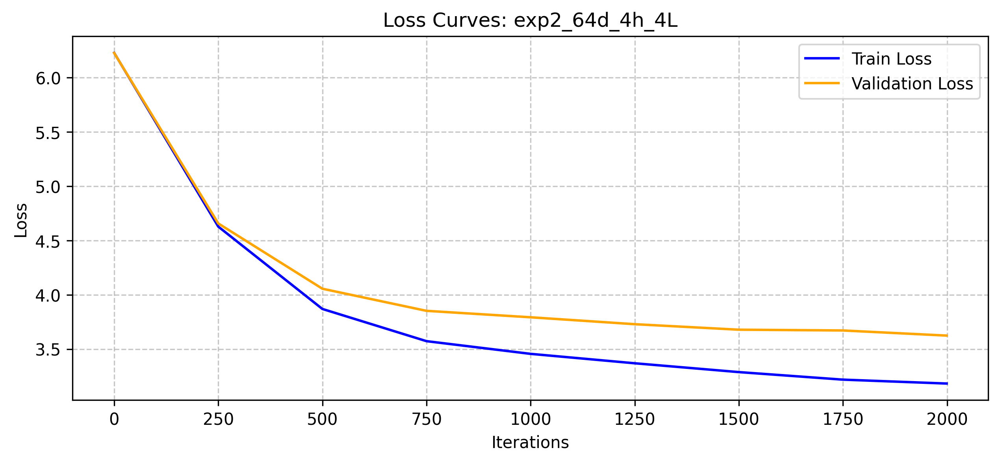

# Tiny Shakespeare Transformer Experiments

A PyTorch causal language model with byte-pair tokenization, sinusoidal positions,
multi-head attention, and pre-normalization with RMSNorm. This project compares
seven width/head/depth configurations on Tiny Shakespeare and records training
curves, attention maps, and generated samples.

The original work was completed for an applied machine-learning course in April
2026 by Junzhe Zong. The notebook, report, and historical outputs are preserved.
The standalone model, CPU demo, and tests were added during portfolio cleanup in
September 2026 with AI assistance.

## Run a small CPU demo

Python 3.11 or newer is recommended. The demo reads the bundled text and tokenizer;
it does not download a model or start the seven-experiment sweep.

```bash
python3 -m venv .venv
source .venv/bin/activate
python -m pip install 'torch>=2.6,<3' --index-url https://download.pytorch.org/whl/cpu
python -m pip install -r requirements.txt
python demo.py
python -m unittest discover -s tests -v
```

The default demo runs five CPU training steps and generates 32 tokens. This checks
that batching, loss calculation, backpropagation, and sampling work. Its output
is not intended to be fluent or to reproduce the historical validation scores.

## Generate from an original checkpoint

Weights are excluded from Git. If you have the experiment-2 state dictionary:

```bash
python demo.py --checkpoint /path/to/exp2_64d_4h_4L_weights.pth --prompt 'O Romeo, Romeo! ' --tokens 64
```

The default configuration matches experiment 2: embedding dimension 64, four
heads, four layers, context 64, and the bundled tokenizer's 500-token vocabulary.
For another checkpoint, specify `--embedding-dim`, `--heads`, `--layers`, and
`--context` to match its training configuration and supply the corresponding
tokenizer with `--tokenizer`. Changing the tokenizer can change token meanings
even when the vocabulary size matches.

The demo uses the saved BPE tokenizer for encoding and decoding and loads only
the checkpoint's weights on CPU. The model keeps the original state-dictionary
names, and a test compares its logits and loss with the notebook model using
identical weights.

## Experiments and findings

All seven historical runs used 2,000 training steps, context length 64, batch
size 32, and learning rate `1e-3`. Embedding dimensions ranged from 64 to 512,
heads from 4 to 32, and depth from 1 to 128 layers.

| Configuration | Embedding | Heads | Layers | Reported validation loss |
| --- | ---: | ---: | ---: | ---: |
| Experiment 1 | 64 | 4 | 2 | 3.7020 |
| Experiment 2 | 64 | 4 | 4 | 3.6241 |
| Experiment 4 | 512 | 8 | 16 | 4.4122 |
| Experiment 6 | 512 | 8 | 32 | 4.8123 |
| Experiment 7 | 512 | 32 | 128 | 4.6464 |

These are values reported in [the original course report](aml_a3.pdf), not
measurements rerun during cleanup. Experiment 2 has the lowest validation loss
among the five configurations tabulated in that report; results for experiments
3 and 5 are not included in its summary table. Saved plots and text samples
exist for all seven configurations.



The observed runs suggest that increasing capacity under this fixed training
setup did not reliably improve validation loss. They do not establish a universal
optimal architecture or prove a specific cause of instability.

## Limits and next experiments

- The tokenizer was fitted on the full corpus before the sequential 80/20 split.
  A stricter evaluation would split the raw text first and fit BPE on training
  text only, then retokenize and rerun all comparisons.
- The reported comparisons lack repeated seeds and uncertainty estimates.
  Architecture changes share a fixed learning rate and step budget, not an
  equal compute budget or individually tuned optimizers.
- Loss curves and one attention head do not by themselves establish gradient
  explosion or causal explanations for instability. Those interpretations in
  the historical report need gradient statistics and controlled experiments.
- Generated examples are qualitative. No external language-model benchmark or
  downstream deployment is claimed.
- The historical notebook uses globals and CUDA-specific telemetry. Its final
  sweep includes a 128-layer run and is not a quick CPU demonstration.

## Repository guide

| File | Purpose |
| --- | --- |
| `model.py` | Configurable model with explicit validation; no notebook globals |
| `demo.py` | Small CPU training check and checkpoint-based text generation |
| `tests/test_model.py` | Causal masking, gradients, notebook equivalence, generation, tokenizer checks |
| `transformer.ipynb` | Original notebook and experiment sweep |
| `aml_a3.pdf` | Historical course report |
| `exp*_loss.png`, `exp*_attention.png`, `exp*_sample.txt` | Historical experiment outputs |
| `tiny_shakespeare_bpe.json` | Saved byte-level BPE tokenizer |

For the notebook environment, install `requirements-notebook.txt` and open
`transformer.ipynb` in JupyterLab. Review the sweep cell before executing it.

## Credits

Tiny Shakespeare comes from [Andrej Karpathy's char-rnn dataset](https://github.com/karpathy/char-rnn/tree/master/data/tinyshakespeare).
For a related educational GPT-style implementation, see
[Karpathy's language-model tutorial](https://github.com/karpathy/ng-video).
This course version uses RMSNorm and sinusoidal positions. Dependencies include
[PyTorch](https://pytorch.org/) and [Hugging Face Tokenizers](https://huggingface.co/docs/tokenizers/).
The original report contains its AI-tool disclosure. No repository-wide license
has been added to the pre-existing course materials.
